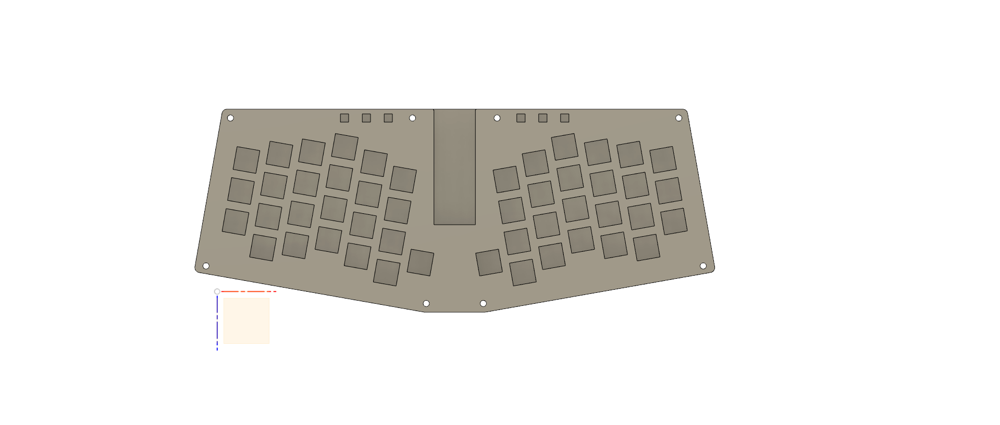
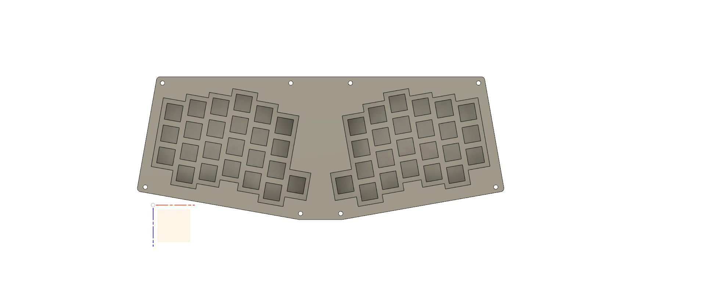

# NNaisu Keyboard Project

Based on Atreus42 Keyboard, added 6 additional button to help coders and 6 Led Indicator also support QMK.

## Assembly

Material | Quantity | Price (IDR)
------------ | ------------- | -------------
Teensy 2.0++ | 1 | 300.000
Stainless Steel Plate | 1 | 250.000
Stainless Steel Bottom | 1 | 70.000
Acrylic Top | 1 | 100.000
Acrylic Mid 6mm | 1 | 100.000
M3 * xxmm | 8 | 20.000
Cherry or Clone switches | 48 | 500.000
1N4148 Diode | 48 | 5.000
LED / Stripe | 6 | 50.000
Cone Feet | pair | 150.000

## Progress
- [x] Layout Design
- [X] Case Design (switch plate, bottom, middle and top)
- [ ] Print Case Design Proto
- [ ] Build firmware (QMK)
- [ ] Build Proto
